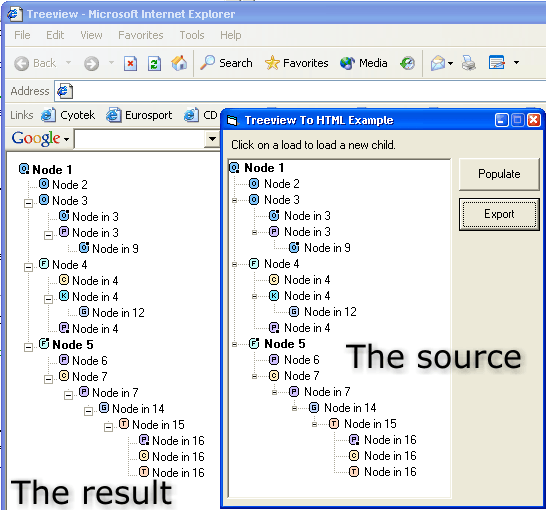



## Export treeview to HTML

### Description

This code takes a treeview as parameter and generates HTML that exactly represates this treeview. This includes indentation, images, bold-text, etc.

I couldn't find any good code that could generate the right HTML (there were lots of errors in most of the code) so I decided to make my own version.

This code is based on code by Chetan Sarva and for a little bit on Manu Bangia.
 
### More Info
 
The treeview itself, the directory where the treeview images are stored and the directory where the images are stored that are used by the treeview

Just call the Tree2HTML(...) function with the right paramters

A HTML string

             |
---                |---
**Submitted On**   |2002-01-14 17:51:04
**By**             |[Koen Muilwijk](https://github.com/Planet-Source-Code/PSCIndex/blob/master/ByAuthor/koen-muilwijk.md)
**Level**          |Intermediate
**User Rating**    |5.0 (25 globes from 5 users)
**Compatibility**  |VB 6\.0
**Category**       |[Internet/ HTML](https://github.com/Planet-Source-Code/PSCIndex/blob/master/ByCategory/internet-html__1-34.md)
**World**          |[Visual Basic](https://github.com/Planet-Source-Code/PSCIndex/blob/master/ByWorld/visual-basic.md)
**Archive File**   |[Export\_tre486021142002\.zip](https://github.com/Planet-Source-Code/koen-muilwijk-export-treeview-to-html__1-30789/archive/master.zip)

